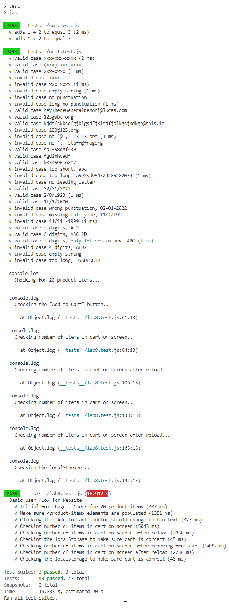

# Lab 8 - Starter

Check Your Understanding:

- 1: I have chosen #1, 'Within a Github action that runs whenever code is pushed.' This is where we would fit automated tests in our pipeline because we want our automated tests to automatically run while we develop the project, hence the description of it being automated. We want to be able to delegate the testing task by using other pieces of code, to free us up from menially manually running the tests every time we make changes and push code. This saves a tremendous amount of time, and mental energy. The whole point of a pipeline is to create an assembly line for code, where we can more quickly and easily add or change code, and know the effects through the automated testing. I will mention that #3 is the worst option, creating a bunch of tests to only run them at the end is very counterproductive, as you might have to heavily backtrack at the end due to all the tests failing. If we automate tests to run every time we push code, we can build portions of the project incrementally, and have feedback on how the code is working, making it easier to spot issues and fix those issues. Ultimately, we want to take the tedious task of running tests constantly and make it happen without our effort, since testing our code makes it much more robust; and then we can avoid the tedium and focus on the aspects of the code that do really matter.

- 2: No. You would use a unit test to check if a function is returning the correct output. End to end testing is used to simulate an end user, so you would use it to test the overall application and the overall functionality of the app.

- 3: No, we would not use a unit test to test this message functionality. The reason is because the message feature is a user writing and sending a message to to another user, testing it would need to use or account for user activity and behavior. This means end to end testing would be a better option to test this feature. This situation is much more about how the overall app works, and how the components interact with each other, so unit testing would be a poor choice. The entire application would effectively be what you are testing in this case, so you need E2E testing for that.

- 4: Yes, we would use a unit test to test the 'max message length' feature of an application. This being is this is a clearly defined chunk, or unit, of the program. And we can easily test both the positive and negative cases for this feature. We can test what happens if the message is above or below the max message length and see if that is functioning properly. Also, since this more a modular unit, we can easily debug and change this functionality in particular, without it affecting too much of the entire application. 

